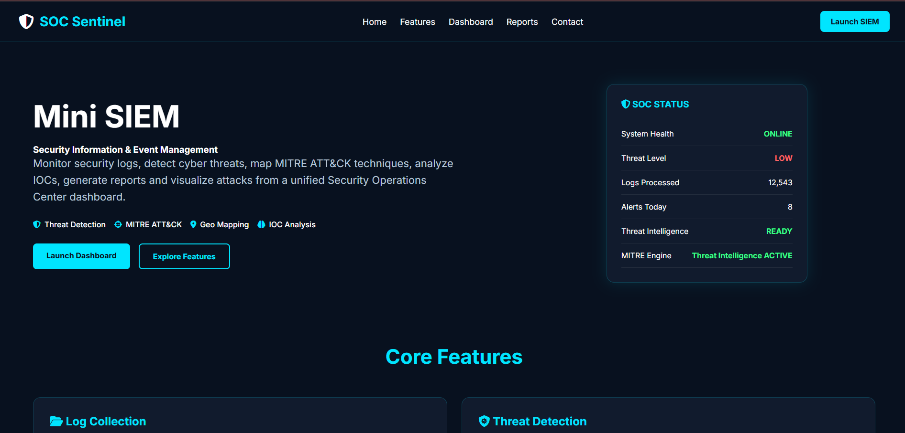
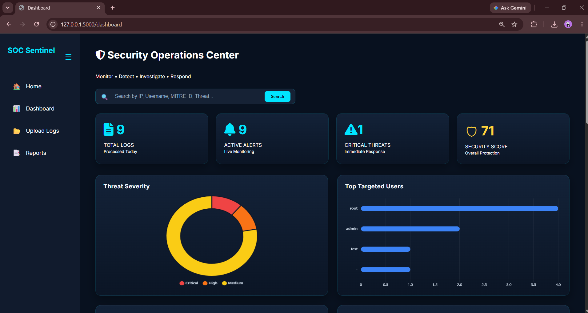
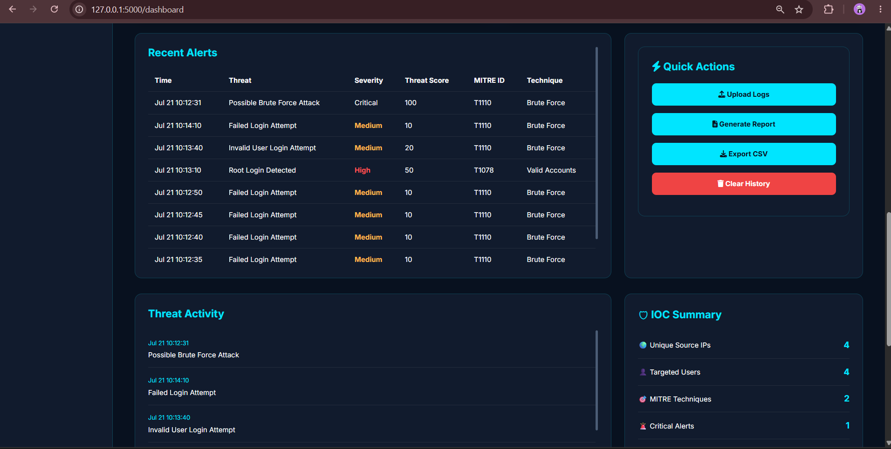
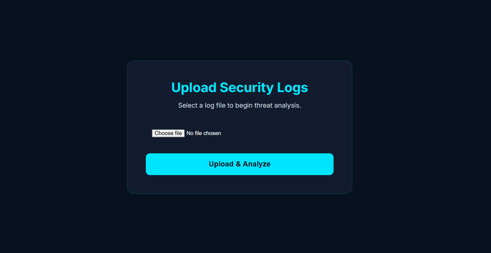
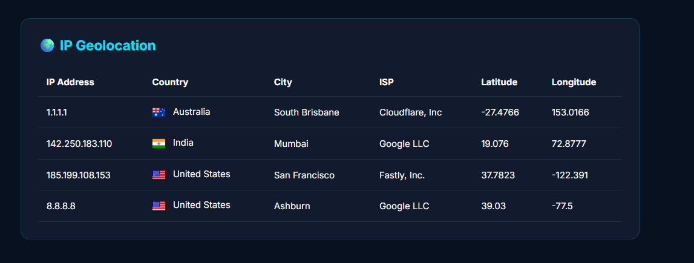
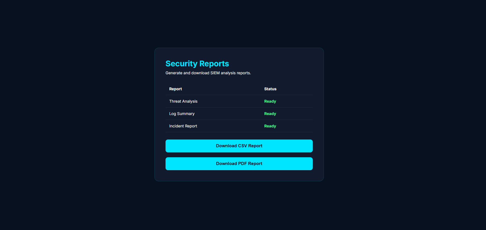
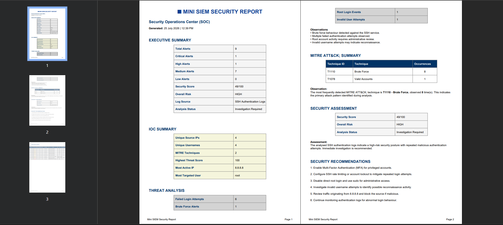

# 🛡️ SOC Sentinel

*A Mini Security Information and Event Management (SIEM) Platform*

A lightweight **Security Information and Event Management (SIEM)** application built using **Python** and **Flask** to analyse security log files, detect suspicious activities, extract Indicators of Compromise (IOCs), map attacks to the **MITRE ATT&CK** framework, perform IP geolocation, and generate professional PDF & CSV security reports through an interactive dashboard.

---
## 🌐 Live Demo

[](https://soc-sentinel.onrender.com)

🔗 https://soc-sentinel.onrender.com

> **Note:** The application is hosted on Render's free tier. The first request after inactivity may take 30–60 seconds while the server wakes up.
## ✨ Features

- 📂 Upload and analyse security log files
- 🚨 Detect suspicious activities and security alerts
- 🎯 MITRE ATT&CK technique mapping
- 🔍 IOC extraction (IP addresses & usernames)
- 🌍 IP geolocation lookup
- 📊 Interactive security dashboard with charts and metrics
- 📑 Generate PDF & CSV security reports
- 💾 Store analysed data using SQLite

---

## 🛠️ Tech Stack

| Category | Technology |
|-----------|------------|
| Backend | Python, Flask |
| Frontend | HTML, CSS, JavaScript |
| Database | SQLite |
| Charts | Chart.js |
| Reporting | ReportLab, CSV |
| Security | MITRE ATT&CK |

---

## 📸 Screenshots

### 🏠 Home



### 📊 Dashboard Overview



### 📈 Dashboard Analysis



### 📂 Upload Logs



### 🌍 IP Geolocation



### 📑 Reports



### 📄 Generated Security Report



---

## 📁 Project Structure

```text
mini-siem/
│
├── detection/
├── geo/
├── ioc/
├── parser/
├── reports/
├── sample_logs/
├── screenshots/
├── search/
├── static/
├── templates/
├── uploads/
├── app.py
├── requirements.txt
├── README.md
└── .gitignore
```

---

## 🚀 Installation

```bash
git clone https://github.com/tanviagrawalnew-bot/mini-siem.git

cd mini-siem

python -m venv venv

# Windows
venv\Scripts\activate

pip install -r requirements.txt

python app.py
```

Open your browser:

```text
http://127.0.0.1:5000
```

### 🧪 Sample Logs

Sample log files for testing are available in the `sample_logs/` directory.

---

## 📖 Workflow

```text
Upload Log
     │
     ▼
Log Parsing
     │
     ▼
Threat Detection
     │
     ├── IOC Extraction
     ├── MITRE ATT&CK Mapping
     ├── IP Geolocation
     ▼
Dashboard
     │
     ▼
PDF & CSV Reports
```

---

## 🚀 Future Improvements

- Real-time log monitoring
- Threat Intelligence API integration (VirusTotal, AbuseIPDB)
- Email alerts
- Advanced search & filtering
- User authentication
- Docker support
- CI/CD with GitHub Actions

---

## 👩‍💻 Authors

**Tanvi Agrawal**  
B.Tech CSE Student

**Kajal Singh**  
B.Tech CSE Student

---

## 📄 License

This project is developed for educational and learning purposes.